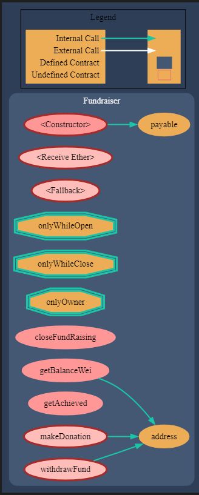

# ₿ Blockchain Introduction Course ₿

This project is for the BlockChain Introduction course - Blockchain Development Master

## :zap: Try it!

You can simply copy and paste the code in FundRaiser.sol and use the remix free on line editor to test the project :
https://remix.ethereum.org/

## Canvas presentation (italian)

https://www.canva.com/design/DAFuFRryS3Y/7y9qbLnUNMXD8iVJYCLgQw/edit?utm_content=DAFuFRryS3Y&utm_campaign=designshare&utm_medium=link2&utm_source=sharebutton

## :question: Why

This project is the final practice for start2impact Intorduction to Blockchain course. 
A small non-profit organization operating in the food sector wants to create a charity fundraising portal.

One of the organization's founders would like to leverage blockchain, as this innovative technology could be just what they are looking for to automate the collections they organize monthly.

However, he does not have the necessary knowledge to exploit technology, which is why he asks you for help in carrying out the project and explaining to him what is behind a job of this type.

To satisfy his requests, he develops a single smart contract with the knowledge gained in theory, assuming that it is a prototype and therefore manages only one test collection.

The contract will be the heart of the fundraising platform, and in particular it must contain:

A variable representing the total balance collected
An "address" type variable representing the address of the fundraising manager, instantiated when the contract is created
A variable representing the goal set by the collection creator, instantiated when the contract is created
A variable that contains the total number of donors
A variable that determines whether the fundraising is completed or not, depending on whether the objective has been achieved
A function that allows you to donate Ether to the contract, updating the balance and the number of donors
A function that allows only the fundraising manager to withdraw the Ether collected in the contract
A function that closes the fundraising
A function that checks whether the goal set by the creator of the collection has been reached or exceeded.

## :computer: Languages

- SOLIDITY 0.8

## :books: Surya Graph

## :globe_with_meridians: External Services

- [Remix-Ide](https://remix.ethereum.org/)

## Clone the repository

`git clone https://github.com/boobaGreen/S2I-Food-Blockchain-IntroCourse`

## 📃 License

[MIT](https://choosealicense.com/licenses/mit/)

## 📧 Contact Me

Any questions? Send me an e-mail here: [claudiodallara77@gmail.com](mailto:claudiodallara77@gmail.com)  
You can find my Linkedin profile here: [https://www.linkedin.com/in/claudio-dall-ara-244816175/](https://www.linkedin.com/in/claudio-dall-ara-244816175/)
